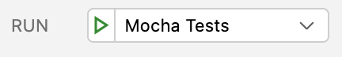

<h2 align="center">
    <br>
	
	<br>
</h2>

# LiveBundle CLI

[![ci][1]][2] [![codecov][3]][4]

**Website** livebundle.io\
**Documentation**  docs.livebundle.io

# Debugging

Debugging can be achieved in [Visual Studio Code][5].

## CLI

To debug the CLI, open livebundle project in Visual Studio Code and run `yarn debug` from a Visual Studio code terminal *(important, otherwise Visual Studio code will not auto attach debugger)*.

This is equivalent to running the `livebundle` CLI executable, but with debugging enabled.
It is thus possible to provide any supported command and option(s) as if directly running the `livebundle` CLI executable.

## Mocha Tests

To debug mocha tests, launch `Mocha Tests` debug configuration from the IDE.



# Logging

LiveBundle is using the [debug][6] library to for logging.\
Please refer to this library documentation for reference.\
In a nutshell, to enable all logs, just set the `DEBUG=*` environment variable.

# Repository structure _(curated)_

```
.
├── lerna.json            // Lerna configuration
├── packages              // Node.js packages
│   ├── livebundle                      // Command line CLI
│   ├── livebundle-bunder-metro         // Metro Bundler
│   ├── livebundle-generator-deeplink   // Deep link generator
│   ├── livebundle-generator-qrcode     // QR Code generator
│   ├── livebundle-notifier-github      // GitHub notifier
│   ├── livebundle-notifier-terminal    // Terminal notifier
│   ├── livebundle-notifier-viewer      // Viewer notifier
│   ├── livebundle-sdk                  // SDK
│   ├── livebundle-storage-azure        // Azure Storage provider
│   ├── livebundle-storage-fs           // File System Storage provider
│   └── livebundle-utils                // Misc utilities
├── README.md             // This README ;)
├── tsconfig.build.json   // TypeScript config used for builds
├── tsconfig.json         // TypeScript config used by monorepo
├── .eslintignore.json    // Files/Directories to exclude from ESLint
├── .eslintrc.js          // ESLint configuration
├── .mocharc.json         // Mocha configuration
├── .nycrc                // nyc (coverage) configuration
├── .prettier.rc          // Prettier configuration
└── .vscode               // VSCode IDE configuration
    └── settings.json     // VSCode workspace configuration
```

# Related repositories

- [react-native-livebundle](https://github.com/electrode-io/react-native-livebundle) contains LiveBundle React Native native module along with a demo application.
- [LiveBundle website](https://github.com/electrode-io/livebundle-website) contains the LiveBundle website and user documentation *(outdated)*

[1]: https://github.com/electrode-io/livebundle/workflows/ci/badge.svg
[2]: https://github.com/electrode-io/livebundle/actions
[3]: https://codecov.io/gh/electrode-io/livebundle/branch/master/graph/badge.svg?token=97VWVN63G0
[4]: https://codecov.io/gh/electrode-io/livebundle
[5]: https://code.visualstudio.com/
[6]: https://www.npmjs.com/package/debug
